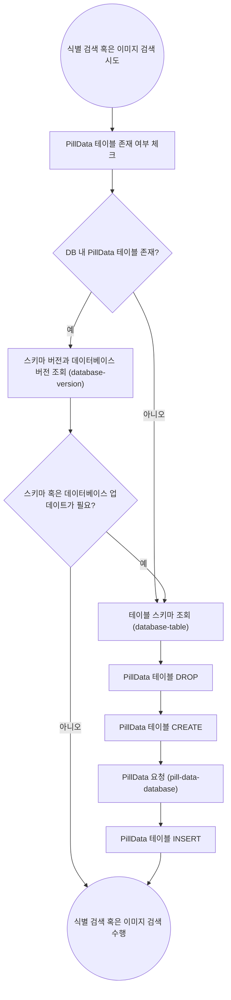

```mermaid
flowchart TD
    %% start
    start((식별 검색 혹은 이미지 검색 시도)) --> check_exist_pilldata_table[PillData 테이블 존재 여부 체크]
    
    check_exist_pilldata_table --> is_exist_pill_data_table{DB 내 PillData 테이블 존재?}

    %% is_exist_pill_data_table
    is_exist_pill_data_table -->|예| request-database-version["스키마 버전과 데이터베이스 버전 조회 (database-version)"]
    is_exist_pill_data_table -->|아니오| reqeust_table_schema["테이블 스키마 조회 (database-table)"]


    request-database-version --> check_require_update{스키마 혹은 데이터베이스 업데이트가 필요?}


    %% check_require_update
    check_require_update -->|예| reqeust_table_schema
    check_require_update -->|아니오| search((식별 검색 혹은 이미지 검색 수행))


    reqeust_table_schema --> drop_pill_data_table[PillData 테이블 DROP]
    drop_pill_data_table --> create_pill_data_table[PillData 테이블 CREATE]
    create_pill_data_table --> request_pill_data_database["PillData 요청 (pill-data-database)"]
    request_pill_data_database --> insert_pill_data[PillData 테이블 INSERT]

    insert_pill_data --> search
```