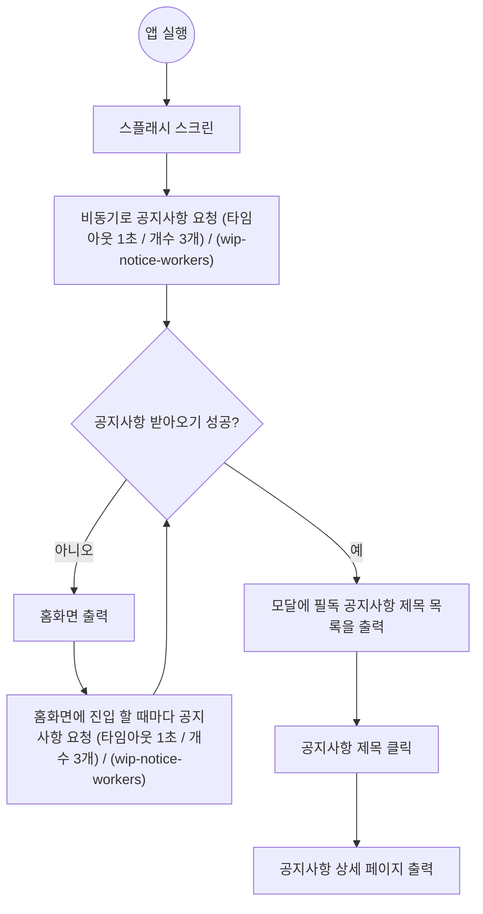

```mermaid
flowchart TD
    %% start
    start((앱 실행)) --> splash_screen[스플래시 스크린]
    splash_screen --> request_async_must_read_notice["비동기로 공지사항 요청 (타임아웃 1초 / 개수 3개) / (wip-notice-workers)"]

    request_async_must_read_notice --> is_success_response{"공지사항 받아오기 성공?"}


    %% is_success_response
    is_success_response -->|예| print_modal["모달에 필독 공지사항 제목 목록을 출력"]
    is_success_response --> |아니오| print_home_screen[홈화면 출력]


    %% retry
    print_home_screen --> retry["홈화면에 진입 할 때마다 공지사항 요청 (타임아웃 1초 / 개수 3개) / (wip-notice-workers)"]
    retry --> is_success_response


    %% notice modal
    print_modal --> view_notice[공지사항 제목 클릭]
    view_notice --> print_notice_detail[공지사항 상세 페이지 출력] 
```