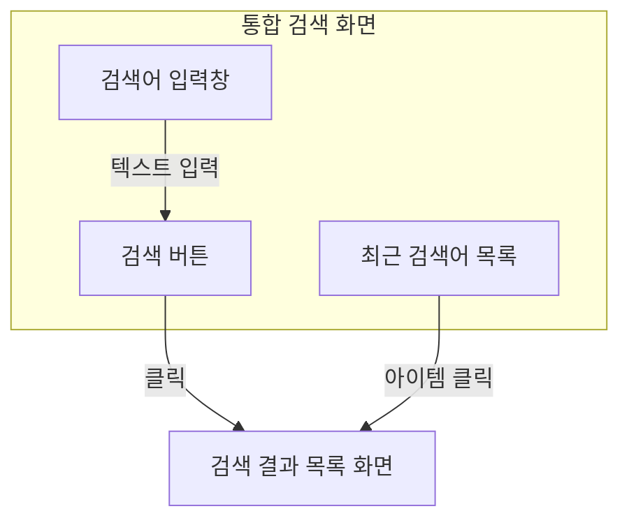
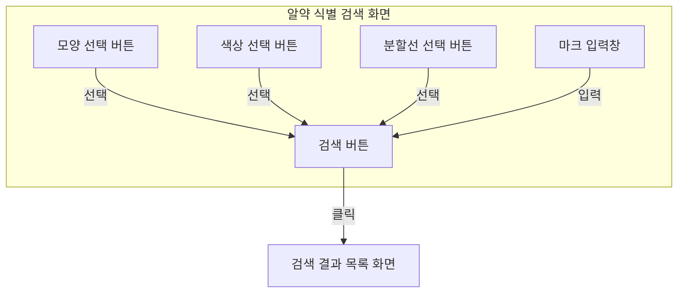
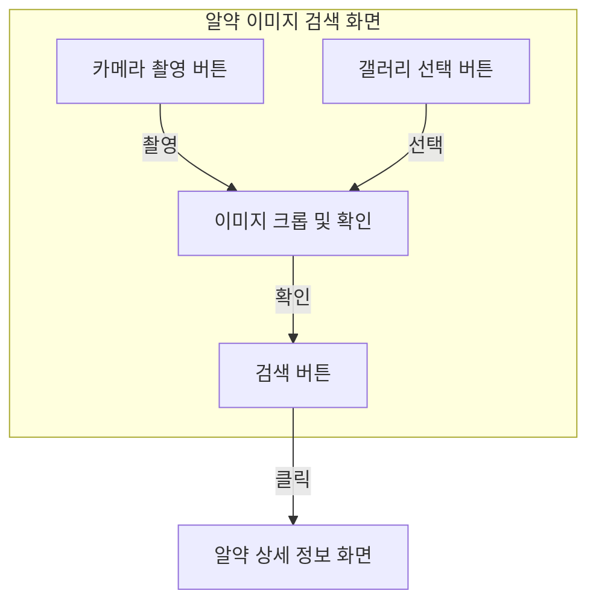
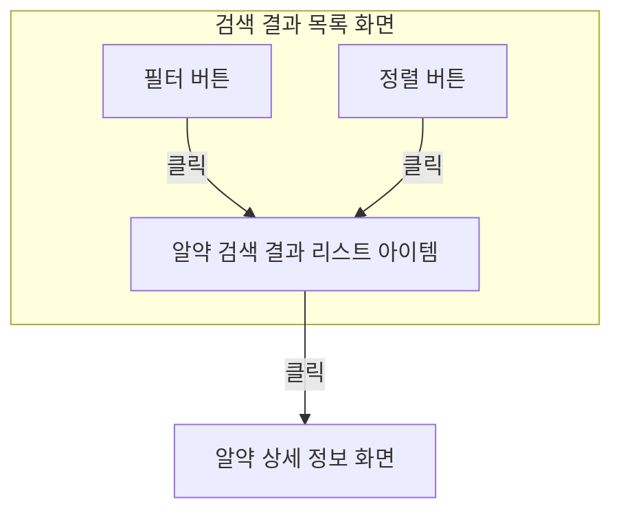
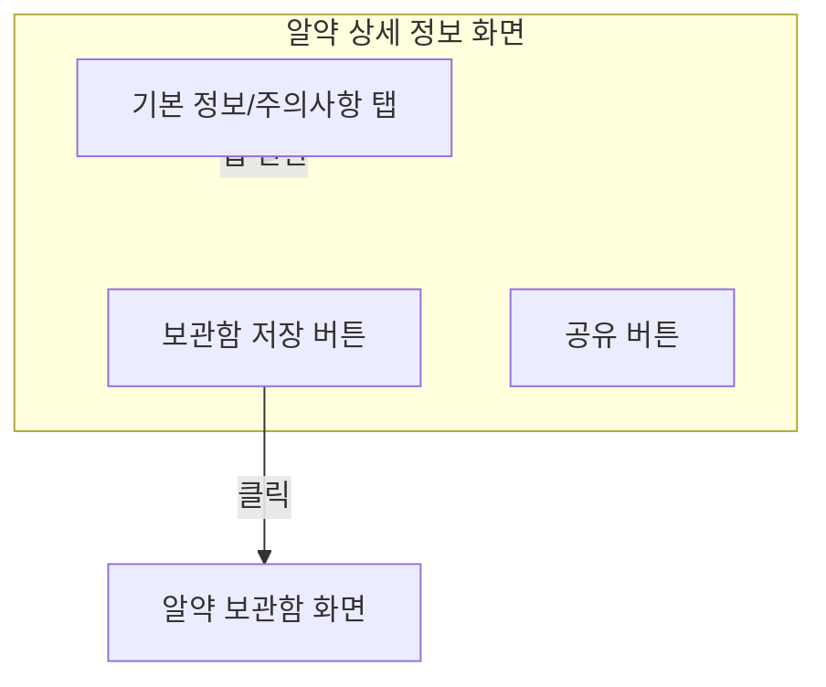
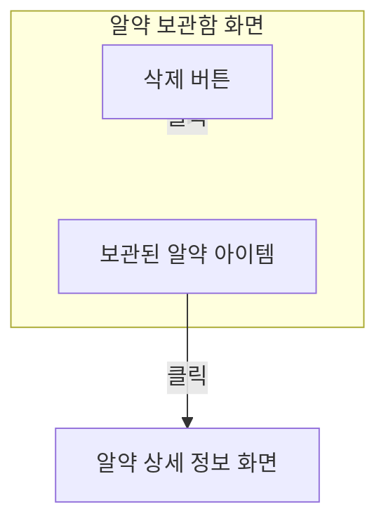
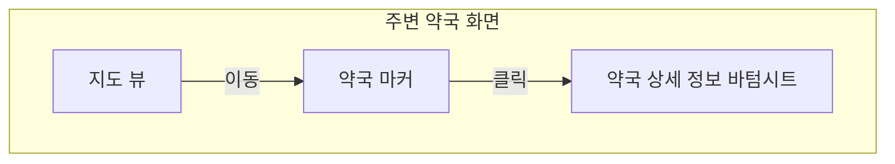
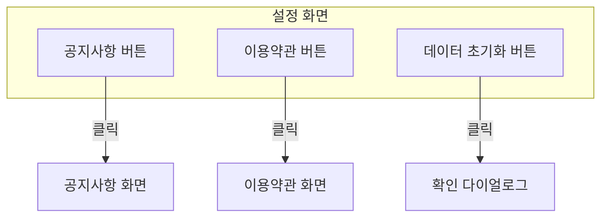

# Screen Flowcharts

## 1. Unified Search (통합 검색)

## 2. Pill Identification Search (알약 식별 검색)

## 3. Pill Image Search (알약 이미지 검색)

## 4. Pill Search Result List (검색 결과 목록)

## 5. Pill Detail (알약 상세 정보)

## 6. Pill Save (알약 보관함)

## 7. Nearby Pharmacy (주변 약국)

## 8. Setting (설정)

