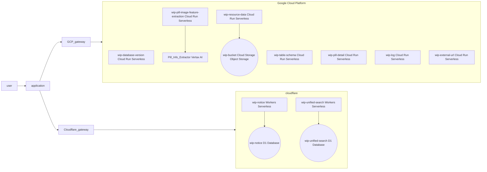

```mermaid
flowchart LR
    user
    application
    GCP_gateway
    Cloudflare_gateway


    %% 클라우드 플레어
    subgraph cloudflare[cloudflare]
        wip-notice-workers["wip-notice Workers Serverless"]
        wip-notice-d1(("wip-notice D1 Database"))
        wip-unified-search-workers["wip-unified-search Workers Serverless"]
        wip-unified-search-d1(("wip-unified-search D1 Database"))

        wip-notice-workers --> wip-notice-d1
        wip-unified-search-workers --> wip-unified-search-d1
    end

    
    %% GCP
    subgraph gcp[Google Cloud Platform]
        wip-database-version["wip-database-version Cloud Run Serverless"]
        wip-table-schema["wip-table-schema Cloud Run Serverless"]
        wip-resource-data["wip-resource-data Cloud Run Serverless"]
        wip-pill-detail["wip-pill-detail Cloud Run Serverless"]
        wip-log["wip-log Cloud Run Serverless"]
        wip-external-url["wip-external-url Cloud Run Serverless"]

        wip-pill-image-feature-extraction["wip-pill-image-feature-extraction Cloud Run Serverless"]
        Pill_Info_Extractor["Pill_Info_Extractor Vertax AI"]

        wip-pill-image-feature-extraction --> Pill_Info_Extractor

        wip-bucket(("wip-bucket Cloud Storage Object Storage"))

        wip-resource-data --> wip-bucket
    end


    %% entry point
    user --> application
    
    application --> GCP_gateway
    application --> Cloudflare_gateway

    Cloudflare_gateway --> cloudflare
    GCP_gateway --> gcp
```
