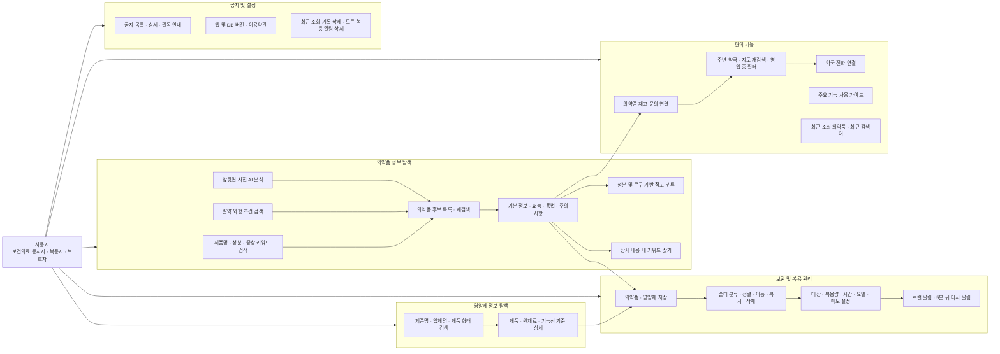

# 유스케이스

앱은 의약품 정보 탐색과 복용 관리, 주변 약국 등 편의 기능을 제공합니다. 알약 외형 식별과 건강기능식품 검색은 각각의 데이터 범위로 구분합니다.

```mermaid
flowchart LR
    User["사용자<br/>보건의료 종사자 · 복용자 · 보호자"]
    subgraph Search[의약품 정보 탐색]
        Unified[제품명 · 성분 · 증상 키워드 검색]
        Identify[알약 외형 조건 검색]
        Image[앞뒷면 사진 AI 분석]
        Results[의약품 후보 목록 · 재검색]
        Detail[기본 정보 · 효능 · 용법 · 주의사항]
        Safety[성분 및 문구 기반 참고 분류]
        Find[상세 내용 내 키워드 찾기]
        Unified --> Results
        Identify --> Results
        Image --> Results
        Results --> Detail
        Detail --> Safety
        Detail --> Find
    end
    subgraph Food[영양제 정보 탐색]
        FoodSearch[제품명 · 업체명 · 제품 형태 검색] --> FoodDetail[제품 · 원재료 · 기능성 기준 상세]
    end
    subgraph Manage[보관 및 복용 관리]
        Save[의약품 · 영양제 저장]
        Folder[폴더 분류 · 정렬 · 이동 · 복사 · 삭제]
        Reminder[대상 · 복용량 · 시간 · 요일 · 메모 설정]
        Notify[로컬 알림 · 5분 뒤 다시 알림]
        Save --> Folder
        Folder --> Reminder
        Reminder --> Notify
    end
    subgraph Convenience[편의 기능]
        Pharmacy[주변 약국 · 지도 재검색 · 영업 중 필터]
        Call[약국 전화 연결]
        Inquiry[의약품 재고 문의 연결]
        Guide[주요 기능 사용 가이드]
        Recent[최근 조회 의약품 · 최근 검색어]
        Pharmacy --> Call
        Inquiry --> Pharmacy
    end
    subgraph Setting[공지 및 설정]
        Notice[공지 목록 · 상세 · 필독 안내]
        Info[앱 및 DB 버전 · 이용약관]
        Clear[최근 조회 기록 삭제 · 모든 복용 알림 삭제]
    end
    User --> Search
    User --> Food
    User --> Manage
    User --> Convenience
    User --> Setting
    Detail --> Save
    FoodDetail --> Save
    Detail --> Inquiry
```

재고 문의는 전화 연결을 지원하며 재고량을 직접 조회하지 않습니다. 복용 관리의 구현 범위는 [기능 정의](../operation/abstraction.md)를 참고합니다.
