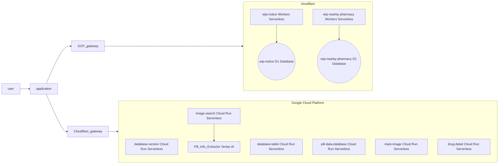

```mermaid
flowchart LR
    user
    application
    GCP_gateway
    Cloudflare_gateway


    %% 클라우드 플레어
    subgraph cloudflare[cloudflare]
        wip-notice-workers["wip-notice Workers Serverless"]
        wip-notice-d1(("wip-notice D1 Database"))
        wip-nearby-pharmacy-workers["wip-nearby-pharmacy Workers Serverless"]
        wip-nearby-pharmacy-d1(("wip-nearby-pharmacy D1 Database"))

        wip-notice-workers --> wip-notice-d1
        wip-nearby-pharmacy-workers --> wip-nearby-pharmacy-d1
    end

    
    %% GCP
    subgraph gcp[Google Cloud Platform]
        database-version["database-version Cloud Run Serverless"]
        database-table["database-table Cloud Run Serverless"]
        pill-data-database["pill-data-database Cloud Run Serverless"]

        mark-image["mark-image Cloud Run Serverless"]

        drug-detail["drug-detail Cloud Run Serverless"]

        image-search["image-search Cloud Run Serverless"]
        Pill_Info_Extractor["Pill_Info_Extractor Vertax AI"]

        image-search --> Pill_Info_Extractor
    end


    %% entry point
    user --> application
    
    application --> GCP_gateway
    application --> Cloudflare_gateway

    GCP_gateway --> cloudflare
    Cloudflare_gateway --> gcp
```