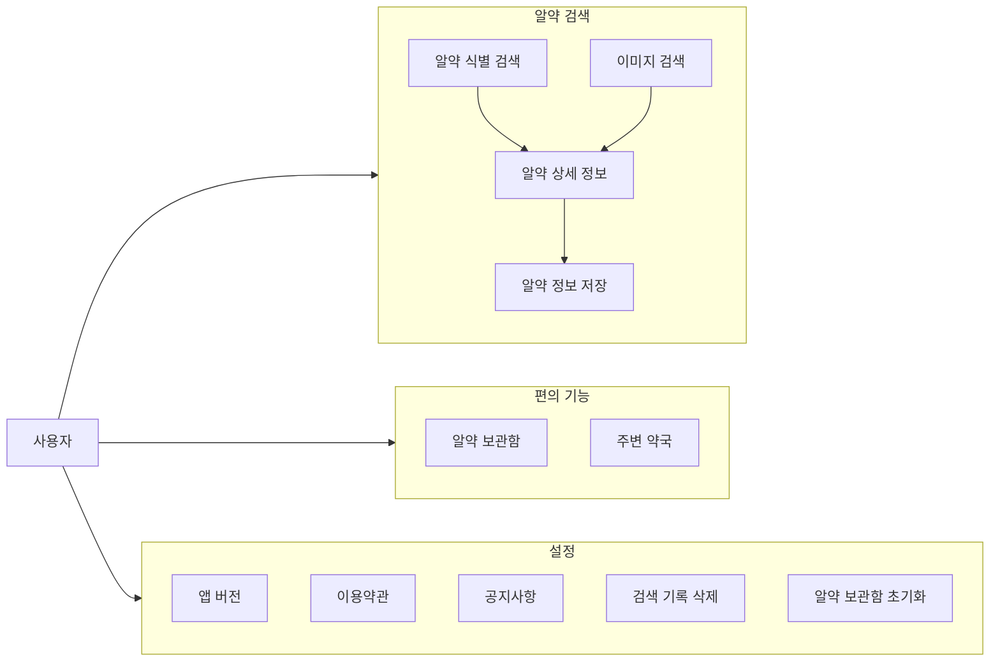

```mermaid
flowchart LR
    user[사용자]

    %% 알약 검색
    subgraph pill_search[알약 검색]
        pill_identification_search[알약 식별 검색]
        pill_image_search[이미지 검색]

        pill_detail[알약 상세 정보]
        save_pill[알약 정보 저장]

        pill_identification_search --> pill_detail
        pill_image_search --> pill_detail
        pill_detail --> save_pill
    end


    %% 편의 기능
    subgraph convenience_features[편의 기능]
        pill_save[알약 보관함]
        nearby_pharmacy[주변 약국]
    end


    %% 설정
    subgraph settings[설정]
        app_version[앱 버전]
        terms_of_service[이용약관]
        notice[공지사항]
        delete_search_record[검색 기록 삭제]
        reset_pill_save[알약 보관함 초기화]
    end


    user --> pill_search
    user --> convenience_features
    user --> settings
```
