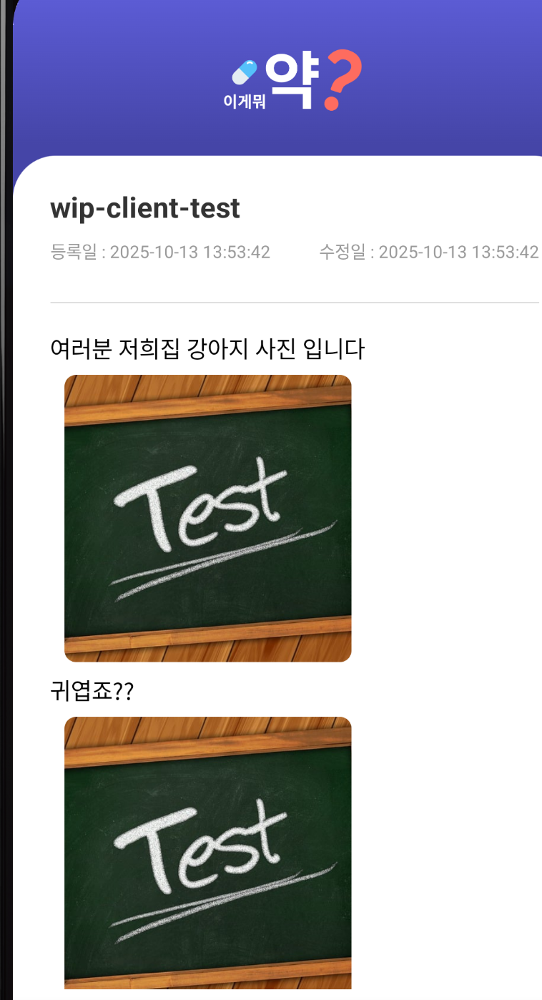
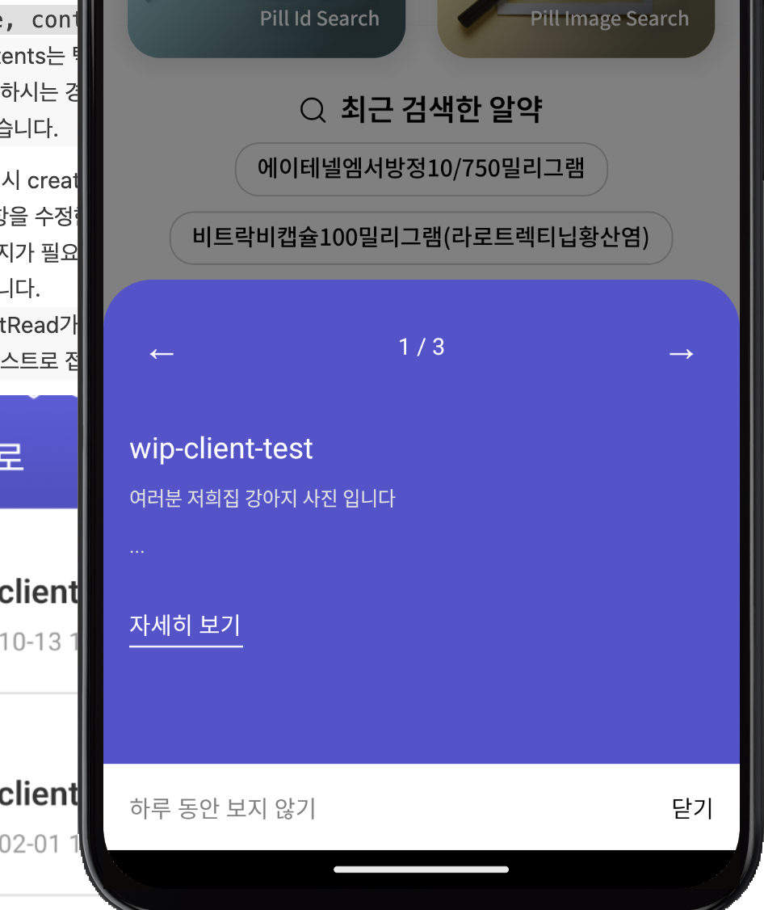
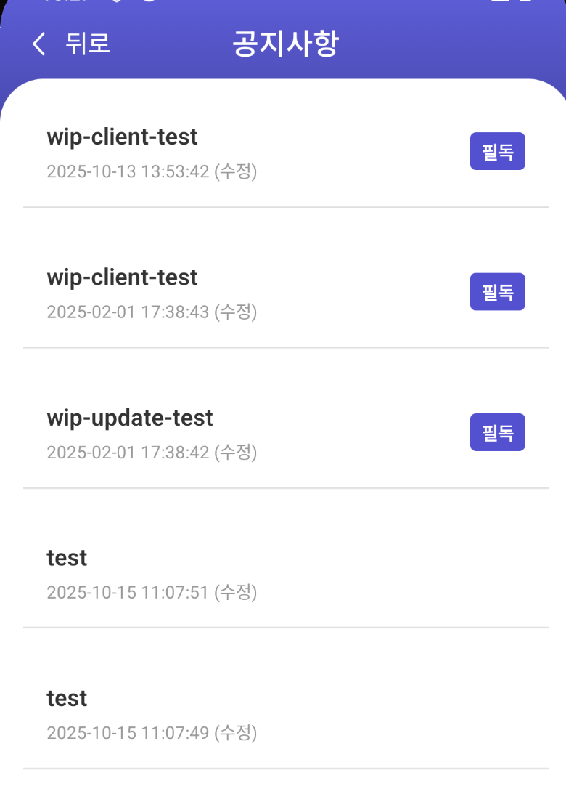

## 공지사항 등록 시 참고해야되는 부분
1. `title, contents` 작성
    > contents는 텍스트, 이미지(base64) 형태로 작성해주시면 됩니다.
    개행 처리를 원하시는 경우 `\n` 를 추가해주시면 앱 상에서 다음 줄로 표시되도록 적용해놓았습니다.

2. 첫 생성 시 createDate 값만 들어가고, `updateDate`는 "" 값으로
3. 공지사항을 수정한 경우 `updateDate` 값 추가되도록 해주시면 됩니다.
4. 필독 공지가 필요한 경우는 `mustRead` 값을 1로 일반 공지인 경우 0으로 설정해주시면 됩니다.
    > mustRead가 1이면 메인에 들어가졌을 때 BottomSheet에 생성되며, 공지사항 리스트로 접근 시 필독 마크와 함께 상단에 노출됩니다.

